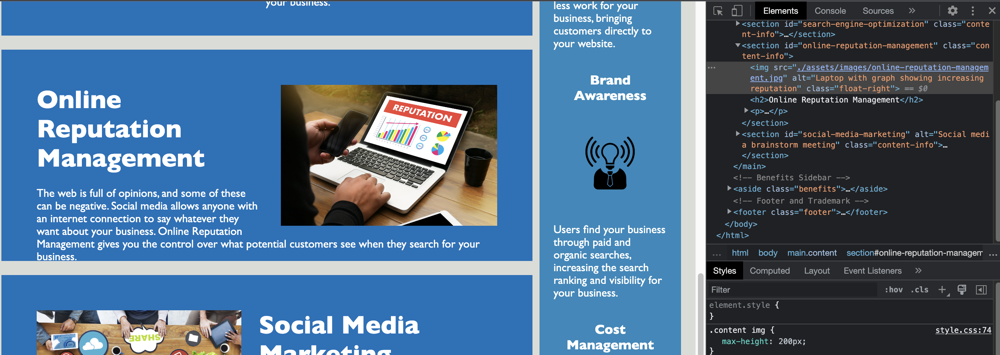

# Challenge One: Horiseon Standardized Accessibility

## Project Description

For this challenge, the HTML and CSS code was refactored to be made more accessible. Webpage accessibilty is especially important for people with disabilities, who may require assitive technologies (i.e., screen readers), to perceive and navigate webpages. Having an accessible website is essential for organizations as well. A website that is accessible to all will rank higher for search engines than one that is less accessible as search engine crawlers. Lastly, the refactored code must be logically structured and with its functionality outlined.

### Accessibility Standardized Example 

The following image shows the webpage's HTML code with alternative text for increased assibility: 

### Link to Github Page
[https://jffsun.github.io/chall-one-accessibility/](https://jffsun.github.io/chall-one-accessibility/).

